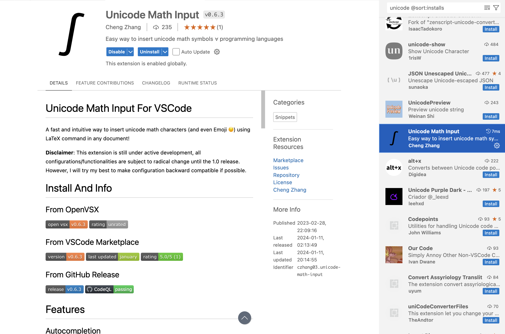
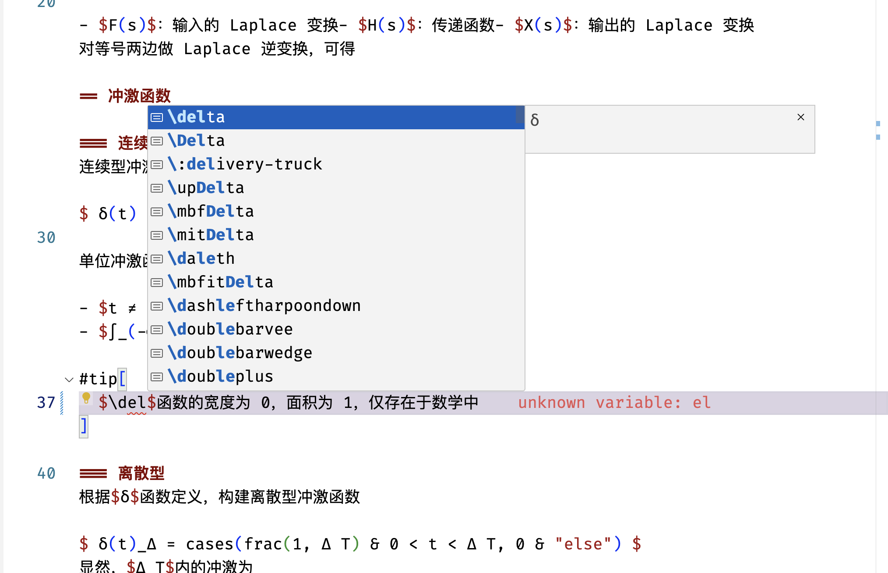

# 搭建 Typst 舒适写作环境

Typst 是一个 Rust 编写的新一代排版软件，是当下 LaTeX 最有力的竞争者。其环境配置非常简单。

## 1. 安装

### 1.1. 软件

对 macOS/Linux 用户，可以使用 Homebrew 安装

```shell
brew install typst
```

Windows 用户，可以使用 Scoop 安装

```shell
scoop install typst git
```

或者 WinGet 安装

```powershell
winget install typst.typst
```

### 1.2. 必需扩展

在 VSCode 中的扩展商店里，搜索并安装 Tinymist 扩展

> 图片没必要展示了。

### 1.3. 格式化

Typst Preview 的作者开发了一个 Typst 十分易用的格式化器，[typstyle](https://github.com/Enter-tainer/typstyle)，其在 Tinymist Typst 有集成接口。

对 macOS/Linux 用户，可以使用 Homebrew 安装

```shell
brew install typstyle
```

Windows 用户，可以使用 Scoop 安装

```shell
scoop install typstyle
```

然后，在`settings.json`中，加入

```json
{
  "[typst]": {
    "editor.defaultFormatter": "myriad-dreamin.tinymist"
  },
  "tinymist.completion.triggerOnSnippetPlaceholders": true,
  "tinymist.exportPdf": "onDocumentHasTitle",
  "tinymist.formatterMode": "typstyle",
  "tinymist.lint.enabled": true,
  "tinymist.outputPath": "$root/articles/$name",
  "tinymist.preview.cursorIndicator": true,
}
```

## 2. 辅助扩展

### 2.1. Unicode

Typst 写 LaTeX 公式时，有时不如 Markdown 那么方便，这时可以使用扩展

- Unicode Math Input



### 2.2. Emoji

除了 Unicode，Typst 中的 Emoji 也存在相似的问题，同样通过上述扩展

通过敲击 `\:`，即可完成相应的转义输入。

## 3. 效果



## 4. 第三方包开发

如果想开发自己的包，请参考 typst-packages 上的说明，在如下路径下克隆 typst-packages 仓库，即先使用 `cd` 命令到对应路径，然后克隆

- Linux：
  - `$XDG_DATA_HOME`
  - `~/.local/share`
- macOS: `~/Library/Application Support`
- Windows：`%APPDATA%`

```shell
cd [above-path]
git clone --depth 1 --branch main https://github.com/typst/packages typst
```
