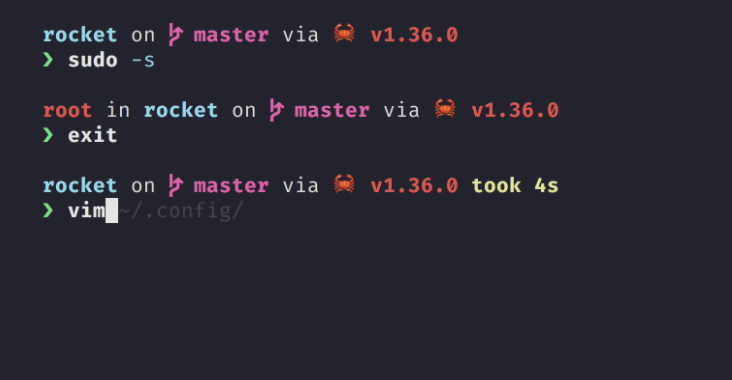
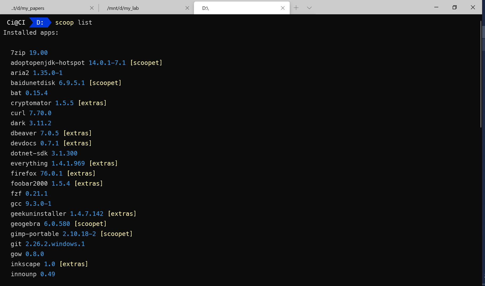
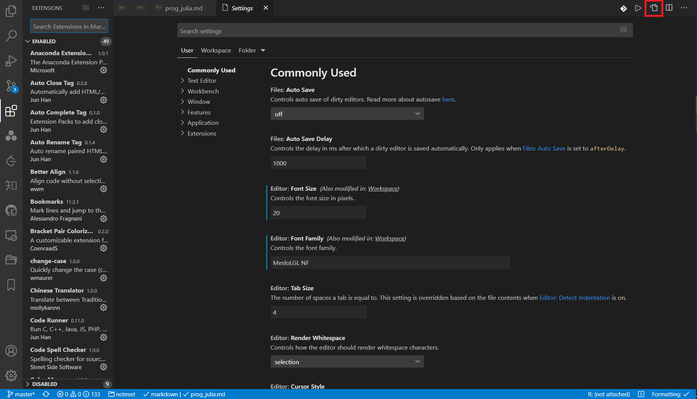

# 打造 Windows 优雅终端

## 1. PowerShell

### 1.1. 主题

Starship 是由 Rust 编写的命令行主题，简单高效、容易配置（基本不用配置），而且跨平台。

使用 Scoop 安装

```shell
scoop install starship
```

打开配置文件

```powershell
code $PROFILE
```

添加

```powershell
Invoke-Expression (&starship init powershell)
```

我之前用 OhMyPosh，但时间长了觉得那些花里胡哨的东西都是浮云，效率才是第一位的，况且 Starship 的默认配置已经可以提供足够多的信息，配置有独立的文件，不与 PowerShell 本身耦合，可定制性高于 OhMyPosh，而且跨平台。

〉详情参考 [Starship 官网](https://starship.rs/)



因为涉及到字体和 Windows-Terminal，这里推荐使用 Scoop 安装（见 Scoop 篇的介绍）：

```powershell
scoop bucket add nerd-fonts
scoop install FiraCode-NF
```

### 1.2. 使用 Linux 命令

安装 `busybox`，其可将 Powershell 的命令替换成对应的 Bash 命令

```powershell
scoop install busybox
```

## 2. PSReadLine

- 安装

在终端中键入如下命令：

```powershell
scoop install psreadline
```

- 配置

打开配置文件

```powershell
code $PROFILE
```

添加以下配置

```powershell
Import-Module PSReadLine

Set-PSReadlineKeyHandler -Key Tab -Function Complete
Set-PSReadLineKeyHandler -Key "Ctrl+z" -Function Undo
Set-PSReadLineKeyHandler -Key UpArrow -Function HistorySearchBackward
Set-PSReadLineKeyHandler -Key DownArrow -Function HistorySearchForward
```

## 3. Windows-Terminal

- 安装

```powershell
scoop install windows-terminal
```

### 3.1. 右键菜单

```powershell
$basePath = "Registry::HKEY_CLASSES_ROOT\Directory\Background\shell"
sudo New-Item -Path "$basePath\wt" -Force -Value "Windows Terminal here"
sudo New-ItemProperty -Path "$basePath\wt" -Force -Name "Icon" -PropertyType ExpandString -Value "C:\Scoop\apps\windows-terminal\current\Images\LargeTile.scale-100.png"
sudo New-Item -Path "$basePath\wt\command" -Force -Type ExpandString -Value '"C:\Scoop\apps\windows-terminal\current\WindowsTerminal.exe" -p PowerShell -d "%V"'
```



### 3.2. 整体配置

```json
{
  "$help": "https://aka.ms/terminal-documentation",
  "$schema": "https://aka.ms/terminal-profiles-schema",
  "actions": [],
  "alwaysOnTop": false,
  "alwaysShowNotificationIcon": false,
  "centerOnLaunch": true,
  "copyFormatting": "none",
  "copyOnSelect": true,
  "defaultInputScope": "alphanumericHalfWidth",
  "firstWindowPreference": "persistedWindowLayout",
  "launchMode": "maximized",
  "newTabMenu": [
      {
          "type": "remainingProfiles"
      }
  ],
  "defaultProfile": "{61c54bbd-c2c6-5271-96e7-009a87ff44bf}",
  "profiles": {
      "defaults": {
          "font": {
              "face": "FiraCode Nerd Font",
              "size": 16
          },
          "snapOnInput": true,
          "useAcrylic": true
      },
      "list": [
          {
              "commandline": "%SystemRoot%\\System32\\WindowsPowerShell\\v1.0\\powershell.exe",
              "guid": "{61c54bbd-c2c6-5271-96e7-009a87ff44bf}",
              "hidden": false,
              "name": "Windows PowerShell",
              "startingDirectory": "D:\\GitHub"
          },
          {
              "commandline": "%SystemRoot%\\System32\\cmd.exe",
              "guid": "{0caa0dad-35be-5f56-a8ff-afceeeaa6101}",
              "hidden": false,
              "name": "Command Prompt"
          },
          {
              "commandline": "C:\\Scoop\\shims\\msys2.cmd",
              "guid": "{6f0ee3d1-ac4f-48ca-bcf5-a9795f9942d2}",
              "icon": "C:\\Scoop\\apps\\msys2-cn\\current\\msys2.ico",
              "name": "MSYS2",
              "startingDirectory": "%USERPROFILE%"
          },
          {
              "guid": "{5bfd203a-d266-5705-bd99-2445051318a1}",
              "hidden": false,
              "name": "Ubuntu-26.04",
              "source": "Microsoft.WSL"
          },
          {
              "guid": "{8bbb00b3-6f7e-507f-a4ac-e454a233067e}",
              "hidden": false,
              "name": "kali-linux",
              "source": "Microsoft.WSL"
          },
          {
              "guid": "{b453ae62-4e3d-5e58-b989-0a998ec441b8}",
              "hidden": false,
              "name": "Azure Cloud Shell",
              "source": "Windows.Terminal.Azure"
          }
      ]
  },
  "keybindings": [
      {
          "id": "Terminal.OpenNewTab",
          "keys": "alt+shift+t"
      },
      {
          "id": "Terminal.NextTab",
          "keys": "alt+tab"
      },
      {
          "id": "Terminal.PrevTab",
          "keys": "alt+shift+tab"
      },
      {
          "id": "Terminal.CopyToClipboard",
          "keys": "ctrl+c"
      },
      {
          "id": "Terminal.PasteFromClipboard",
          "keys": "ctrl+v"
      },
      {
          "id": "Terminal.MoveFocusDown",
          "keys": "alt+down"
      },
      {
          "id": "Terminal.MoveFocusLeft",
          "keys": "alt+left"
      },
      {
          "id": "Terminal.MoveFocusRight",
          "keys": "alt+right"
      },
      {
          "id": "Terminal.MoveFocusUp",
          "keys": "alt+up"
      },
      {
          "id": "Terminal.ResizePaneDown",
          "keys": "alt+shift+down"
      },
      {
          "id": "Terminal.ResizePaneLeft",
          "keys": "alt+shift+left"
      },
      {
          "id": "Terminal.ResizePaneRight",
          "keys": "alt+shift+right"
      },
      {
          "id": "Terminal.ResizePaneUp",
          "keys": "alt+shift+up"
      },
      {
          "id": "Terminal.ClosePane",
          "keys": "alt+shift+d"
      },
      {
          "id": "Terminal.SplitPaneDown",
          "keys": "alt+shift+minus"
      },
      {
          "id": "Terminal.SplitPaneRight",
          "keys": "alt+shift+\\"
      }
  ],
  "schemes": [],
  "tabWidthMode": "titleLength",
  "themes": []
}
```

## 4. 集成

### 4.1. 集成 VSCode



回到 VSCode，"ctrl"+"," 进入配置，点击右上角的图标，打开配置的 json 文件，加入如下配置

```json
{
  "terminal.integrated.shell.windows": "C:/WINDOWS/System32/WindowsPowerShell/v1.0/powershell.exe",
  "terminal.integrated.shellArgs.windows": [
    "-ExecutionPolicy",
    "Bypass",
    "-NoLogo",
    "-NoExit",
    // 初始化命令
    "-Command",
    "clear;cd d:"
  ]
}
```

### 4.2. 集成 Scoop

添加以下配置

```powershell
Import-Module scoop-completion
. ([ScriptBlock]::Create((& scoop-search --hook | Out-String)))
```

### 4.3. 自定义别名

```powershell
# scoop
function sls {scoop list}
function sud {scoop update}
function suda {scoop update *}
function scl {scoop cleanup *}
function sst {scoop status}
function sck {scoop checkup}
function scat {scoop config aria2-enabled true}
function scaf {scoop config aria2-enabled false}
function srm {del -r $env:scoop\cache\*; clear}
```
